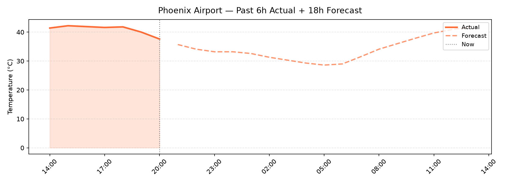

# Pouya Shaeri

Machine Learning Specialist | Data Scientist | Software Developer

I design and build intelligent systems that combine data-driven learning with scientific modeling. My work spans across machine learning, deep learning, environmental data analysis, and software engineering.

---

## 🚀 Areas of Expertise

- Machine Learning & Deep Learning
- Data Mining & Big Data Processing
- Multimodal Data Fusion
- Physics-Informed Neural Networks
- Full-Stack Software Development
- Scientific Computing & Modeling

---

## 🧠 Tech Stack

Python | PyTorch | TensorFlow | Scikit-learn | FastAPI | Flask 

Docker | Kubernetes | Git | SQL | MongoDB  

C++ | OpenCV | LaTeX | JavaScript | React

---

## 🌡️ Arizona Heat Reality — Live

> Auto-updated every 2 hours via GitHub Actions · Data: [Open-Meteo](https://open-meteo.com) · Station: Phoenix Sky Harbor Airport

<!-- Current conditions summary (see weather.md for full table) -->
📄 [View latest conditions →](weather.md)

Because in Arizona, **air temperature is just a suggestion.**

---

## 📊 GitHub Metrics

---

## 📬 Contact

- LinkedIn: https://linkedin.com/in/pouyashaeri
- Website: https://pouyashaeri.github.io
